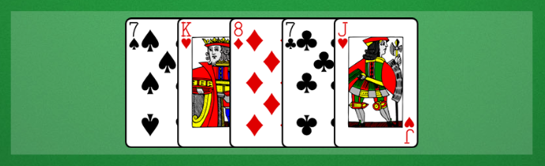

<!-- KDoc -->
[BGADocs]: ../../bgw-gui-kdoc/bgw-gui/tools.aqua.bgw.core/-board-game-application/
[GameComponentViewKDoc]: ../../bgw-gui-kdoc/bgw-gui/tools.aqua.bgw.components.gamecomponentviews/-game-component-view/
[ContainerKDoc]: ../../bpwdgw-gui-kdoc/bgw-gui/tools.aqua.bgw.components.container/-game-component-container/index.html
[AreaKDoc]: ../../bgw-gui-kdoc/bgw-gui/tools.aqua.bgw.components.container/-area/index.html
[TokenKDoc]: ../../bgw-gui-kdoc/bgw-gui/tools.aqua.bgw.components.gamecomponentviews/-token-view/index.html
[CardViewKDoc]: ../../bgw-gui-kdoc/bgw-gui/tools.aqua.bgw.components.gamecomponentviews/-card-view/index.html
[CardStackKDoc]: ../../bgw-gui-kdoc/bgw-gui/tools.aqua.bgw.components.container/-card-stack/index.html
[LinearLayoutKDoc]: ../../bgw-gui-kdoc/bgw-gui/tools.aqua.bgw.components.container/-linear-layout/index.html
[SatchelKDoc]: ../../bgw-gui-kdoc/bgw-gui/tools.aqua.bgw.components.container/-satchel/index.html

<!-- GH-Pages Doc -->
[ComponentViewDoc]: ../../components/componentview/componentview.md
[DynamicView]: ../../components/dynamiccomponentview/dynamiccomponentview.md
[UIComponentsDoc]: ../../components/uicomponents/uicomponents.md
[ContainerExample]: ../../components/container/container.md#complete-source-code-for-the-example

<!-- Links -->
[IterableDoc]: https://kotlinlang.org/api/latest/jvm/stdlib/kotlin.collections/-iterable/

<!-- Start Page -->
# Container
{: .no_toc}

<details open markdown="block">
  <summary>
    Table of contents
  </summary>
  {: .text-delta }
1. TOC
{:toc}
</details>

## Prior knowledge
All containers inherit from [ComponentView][ComponentViewDoc] and [DynamicView][DynamicView]. 
It is therefore helpful to read those documentations first as the features from those superclasses don't get repeated here.

## Introduction
Containers can be used to group
[GameComponentViewKDoc][GameComponentViewKDoc]s.

[GameComponentContainer][ContainerKDoc]
is the abstract baseclass for containers. Different implementations support different styles of layouting for the
contained /components.

## Container features
The Container features will be demonstrated using an [Area][AreaKDoc], since [GameComponentContainer][ContainerKDoc]
is abstract and [Area][AreaKDoc] is just one of the discrete implementations.

The complete source code for this example can be
found [here][ContainerExample].

To create a running example, the required /components are wrapped in a
[BoardGameApplication][BGADocs].

````kotlin
class AreaExample : BoardGameApplication("Area example") {
	val gameScene: BoardGameScene = BoardGameScene(background = ColorVisual.LIGHT_GRAY)
	
	val numberOfComponentsLabel: Label = Label(width = 400, posX = 50, posY = 50)
	val area: Area<TokenView> = Area(100, 400, 50, 100, ColorVisual.DARK_GRAY)
	
	val greenToken: TokenView = TokenView(visual = ColorVisual.GREEN)
	val redToken: TokenView = TokenView(visual = ColorVisual.RED)
}
````

### Add and remove

The most important feature of a container is to add to and remove /components from it.

Adding a Component is as simple as calling the ``add()`` function with the component as its argument. Optionally an 
index
may be supplied. An example on how to add with or without index:

````kotlin
area.add(greenToken)
area.add(redToken, 0)
````

The ``greenToken`` is added to the ``area``. The index parameter was omitted, so it gets added at the end of the
components list. In this case at index 0. Then the
``redToken`` is added explicitly at index 0, therefore ``greenToken`` is pushed back to index 1.

Removing a Component is as simple as calling the ``remove()`` function with the component to remove as its argument.

````kotlin
area.remove(redToken)
````

The ``redToken`` is removed from the ``area``, therefore the ``greenToken`` falls back down to index 0.

There are some convenience functions for adding and removing multiple Components at once. Please refer to
the [docs][AreaKDoc] for an in-depth overview.

### onAdd and onRemove

It is possible to specify code that gets executed with the component as its receiver, after it gets added or removed
from the container. This is helpful whenever some modifications need to be made to any /components, after it is added or
removed.

In this example [TokenView][TokenKDoc]s get resized when they are added to ``area``, and rotated by 45° when they are
removed from ``area``. To achieve this behaviour, the ``onAdd`` and ``onRemove`` fields are set.

````kotlin
area.onAdd = {
	this.resize(100, 100)
}
area.onRemove = {
	this.rotation += 45
}
````

### Listeners

Listeners for the /components list may be added to a container. They get invoked any time the /components list changes its
state. In this example a Label gets updated with the number of /components currently contained in ``area``.

````kotlin
area.addComponentsListener {
	numberOfComponentsLabel.label = "Number of /components in this area: ${area.numberOfComponents()}"
}
````

Listeners can be removed via the ``clearComponentsListners()`` or ``removeComponentsListner()`` functions.

## Useful hints for dealing with containers

- Containers provide an iterator over their /components list via
  the [Iterable][IterableDoc] interface.
  
- The position of /components contained in any containers with automatic layouting should never be modified, since the
  containers handle positioning.

- When using non-automatic layouting containers, do not forget to position the contained /components. Especially if they
  get added after a drag and drop gesture.

- Any Component can only ever be contained in one container at a time. Trying to add an already contained component to
  another container will result in a runtime exception.

- Containers can also be draggable and can act as a drag target.

- ComponentListeners can be a great way of exposing dynamic information about a container via
  sufficient [UIComponents][UIComponentsDoc].

## Types of Containers

### [Area][AreaKDoc]

Area is the simplest form of a container. Its contained /components are positioned relative to the top-left corner of the
Area. No further layouting is provided by the Area.

### [CardStack][CardStackKDoc]

CardStack is a special form of container. It can only contain
[CardView][CardViewKDoc]. 
It should be used to visualize card stacks. It provides automatic layouting and alignment features.

### [LinearLayout][LinearLayoutKDoc]

LinearLayout spaces its /components dynamically based on its dimensions, the /components dimensions, and the user defined
spacing. Additionally, an orientation and alignment may be specified. In this image a LinearLayout is used to 
visualize a hand of cards:



### [Satchel][SatchelKDoc]

A satchel hides its /components and reveals them, when they are removed. This container can be used to visualize an
entity, where the user should not know what might get drawn next, or what is in the container.

## Container overview

[View it on GitHub](https://github.com/tudo-aqua/bgw/tree/main/bgw-examples/bgw-docs-examples/src/main/kotlin/examples/components/container/ContainerExample.kt){:
.btn }

## Complete source code for the example

[View it on GitHub](https://github.com/tudo-aqua/bgw/tree/main/bgw-examples/bgw-docs-examples/src/main/kotlin/examples/components/container/AreaExample.kt){:
.btn }

````kotlin
fun main() {
  AreaExample()
}

class AreaExample : BoardGameApplication("Area example") {
  private val gameScene: BoardGameScene = BoardGameScene(background = ColorVisual.LIGHT_GRAY)

  private val numberOfComponentsLabel: Label = Label(width = 400, posX = 50, posY = 50)
  private val area: Area<TokenView> = Area(100, 400, 50, 100, ColorVisual.DARK_GRAY)

  private val greenToken: TokenView = TokenView(visual = ColorVisual.GREEN)
  private val redToken: TokenView = TokenView(visual = ColorVisual.RED)

  init {
    area.onAdd = {
      this.resize(100, 100)
    }
    area.onRemove = {
      this.rotation += 45
    }

    area.addComponentsListener {
      numberOfComponentsLabel.label = "Number of /components in this area: ${area.numberOfComponents()}"
    }

    area.add(greenToken)
    area.add(redToken, 0)

    area.remove(redToken)

    gameScene.addComponents(area, numberOfComponentsLabel)
    showGameScene(gameScene)
    show()
  }
}
````