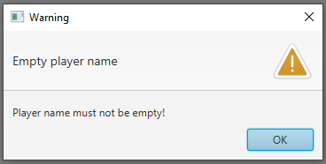
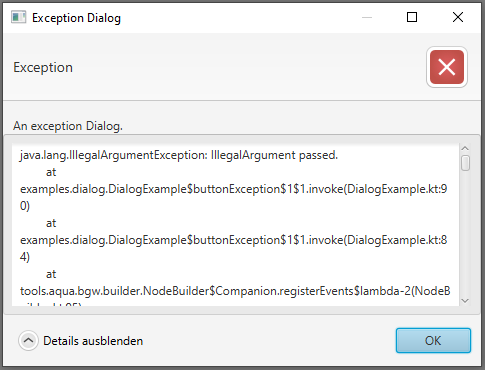

<!-- KDoc -->
[BoardGameApplicationKDoc]: ../../bgw-gui-kdoc/bgw-gui/tools.aqua.bgw.core/-board-game-application/index.html
[DialogKDoc]: ../../bgw-gui-kdoc/bgw-gui/tools.aqua.bgw.dialog/-dialog/index.html
[DialogTypeKDoc]: ../../bgw-gui-kdoc/bgw-gui/tools.aqua.bgw.dialog/-dialog-type/index.html
[ButtonTypeKDoc]: ../../bgw-gui-kdoc/bgw-gui/tools.aqua.bgw.dialog/-button-type/index.html

[showDialogKDoc]: ../../bgw-gui-kdoc/bgw-gui/tools.aqua.bgw.core/-board-game-application/show-dialog.html
[showDialogNonBlockingKDoc]: ../../bgw-gui-kdoc/bgw-gui/tools.aqua.bgw.core/-board-game-application/show-dialog-non-blocking.html

<!-- Links -->
[OptionalDoc]: https://docs.oracle.com/en/java/javase/11/docs/api/java.base/java/util/Optional.html

<!-- Start Page -->
# Dialog
{: .no_toc}

<details open markdown="block">
  <summary>
    Table of contents
  </summary>
  {: .text-delta }
1. TOC
{:toc}
</details>

This section showcases the different types of [Dialogs][DialogKDoc]
in the BGW framework. A Dialog can be used to
display a popup informing the user about warnings, and errors or text.

## Dialog creation

The [Dialog][DialogKDoc] class provides two public constructors for two different types of dialogs:

### Information Dialog
In the information dialog's constructor the type of the dialog can be declared by the [DialogType][DialogTypeKDoc] as

* ``INFORMATION``
* ``WARNING``
* ``ERROR``
* ``CONFIRMATION``
* ``NONE``

which directly affects the displayed icon and default buttons. The buttons can be altered by passing [ButtonTypes][ButtonTypeKDoc].  
Note that ``EXCEPTION`` may not be used, as it is created through the second constructor [here](#Exception dialog).
Additionally, the ``title`` of the popup, the ``header`` and the ``content`` parameters have to be passed.
The following code example creates a warning dialog informing the user about an empty player name:

````kotlin
Dialog(
  alertType = AlertType.WARNING,
  title = "Warning",
  header = "Empty player name",
  message = "Player name must not be empty!"
)
````


### Exception dialog
To display an exception stack trace the second constructor can be used. It takes a ``title``, ``header``, and 
``message``, as well as the ``exception`` to display.
It contains an expandable content for the exception stack trace.

````kotlin
Dialog(
  title = "Exception Dialog",
  header = "Exception",
  message = "An exception Dialog.",
  exception = IllegalArgumentException("IllegalArgument passed.")
)
````


An example with all dialog types can be found here: 

[View it on GitHub](https://github.com/tudo-aqua/bgw/tree/main/bgw-examples/bgw-docs-examples/src/main/kotlin/examples/dialog/DialogExample.kt){:
.btn }
## Showing a dialog
To show a dialog the method [#showDialog][showDialogKDoc] in [BoardGameApplication][BoardGameApplicationKDoc] has to be
used. The operation blocks user input until the dialog is closed. The function returns an [Optional][OptionalDoc] 
containing the chosen [ButtonType][ButtonTypeKDoc]. 
The Optional is empty if the dialog is closed by the *X* or in any other way aside selecting any button.

Alternatively a dialog may be shown by [#showDialogNonBlocking][showDialogNonBlockingKDoc] which shows the Dialog 
without blocking further thread execution. This functions returns ``Unit``.

````kotlin
val dialog: Dialog = Dialog(
    alertType = AlertType.CONFIRMATION, 
    title = "Confirmation required", 
    header = "Confirmation", 
    message = "Do you really want to proceed?"
)

showDialog(dialog).ifPresentOrElse({ 
    if (it == ButtonType.YES) {
        //Button 'YES' was clicked 
    } else {
        //Button 'NO' was clicked 
    }
}) {
	//Dialog was closed
}
````
