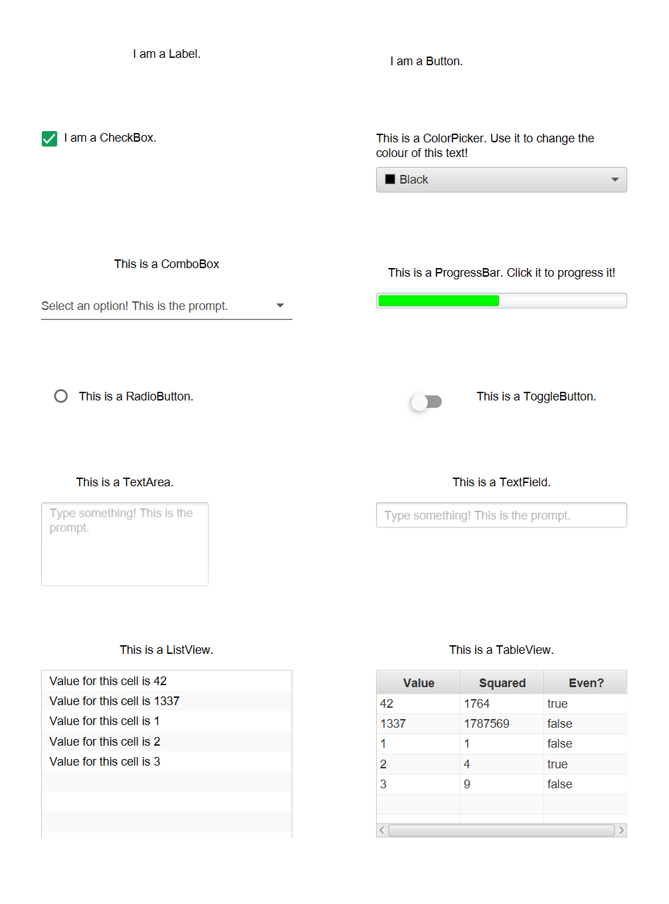

[UIComp]: https://tudo-aqua.github.io/bgw/kotlin-docs/bgw-core/tools.aqua.bgw.components.uicomponents/-u-i-component/index.html

[LUIComp]: https://tudo-aqua.github.io/bgw/kotlin-docs/bgw-core/tools.aqua.bgw.components.uicomponents/-labeled-u-i-component/index.html

[TIUIComp]: https://tudo-aqua.github.io/bgw/kotlin-docs/bgw-core/tools.aqua.bgw.components.uicomponents/-text-input-u-i-component/index.html

[UserInput]: https://tudo-aqua.github.io/bgw/concepts/user-input/UserInput.html

# UIComponents

A [UIComponent][UIComp] may be used to present information to the user or retrieve input. There are three base classes
for UIComponents.

- [UIComponent][UIComp]: the baseclass for all UIComponents
- [LabeledUIComponents][LUIComp]: extends UIComponent and provides additional fields to define a text. E.g. a Button
  with a text.
- [TextInputUIComponents][TIUIComp]: extends UIComponent and provides a text where the user may write to.

**NOTE:** UIComponents are ComponentViews. This means all methods of handling user input discussed in the
[User Input Guide][UserInput] are available to UIComponentViews.

This is a visual example of all the available UIComponents in the framework. Parts of the source code will be used in
this tutorial to demonstrate the most important features of each UIComponent. The full source code can be found [here]()
.



[LabelDoc]: https://tudo-aqua.github.io/bgw/kotlin-docs/bgw-core/tools.aqua.bgw.components.uicomponents/-label/index.html

## Label

A [Label][LabelDoc] is just a simple text. In this example a new label is instantiated with the text "I am a Label.",
aligned to the center and with text wrapping enabled. Enabled text wrapping allows the text to wrap onto a new line if
the width of the label is too small for the text.

````kotlin
private val outputLabel = Label(
	posX = 50,
	posY = 50,
	width = 300,
	text = "I am a Label.",
	alignment = Alignment.CENTER,
	isWrapText = true
)
````

[ButtonDoc]: https://tudo-aqua.github.io/bgw/kotlin-docs/bgw-core/tools.aqua.bgw.components.uicomponents/-button/index.html

## Button

A [Button][ButtonDoc] is a component that plays an animation when a mouse click is performed over the button.
Additionally, a text may be defined to describe the button. In this example a new button is instantiated, and the ``
onMouseClicked`` is set, so that the ``outputLabel`` displays "Someone pressed the Button!".

````kotlin
val button = Button(posX = 450, posY = 50, text = "I am a Button.", visual = ColorVisual.LIGHT_GRAY)

button.onMouseClicked = {
	outputLabel.text = "Someone pressed the Button!"
}

````

[CheckBoxDoc]: https://tudo-aqua.github.io/bgw/kotlin-docs/bgw-core/tools.aqua.bgw.components.uicomponents/-check-box/index.html

## CheckBox

A [CheckBox][CheckBoxDoc] is a component that can be checked or unchecked. It can be enabled to allow an indeterminate
state. This can be used to express uncertainty. Whenever a CheckBox is clicked it changes its state in the following
order:

if indeterminate is not allowed

| ``checked``  | ``isIndeterminate`` |
| ------------ | ------------------- |
| ``false``    | ``false``           |
| ``true``     | ``false``           |

if indeterminate is allowed

| ``checked``  | ``isIndeterminate`` |
| ------------ | ------------------- |
| ``false``    | ``false``           |
| ``false``    | ``true``            |
| ``true``     | ``false``           |

**NOTE:** it is possible to set ``isIndeterminate`` to ``true`` even when indeterminate is not allowed. It is just
impossible to reach the indeterminate state via clicks on the CheckBox.


In this example listeners are added to the ``checkedProperty`` and ``indeterminateProperty``, so that
``outputLabel`` displays the state of the CheckBox, whenever the state changes.

````kotlin
val checkBox =
	CheckBox(posX = 50, posY = 150, width = 300, text = "I am a CheckBox.", alignment = Alignment.CENTER_LEFT)

checkBox.allowIndeterminate = true

checkBox.checkedProperty.addListener { _, newValue ->
	outputLabel.text = if (newValue) "The check box is checked!" else "The check box is unchecked!"
}

checkBox.indeterminateProperty.addListener { _, newValue ->
	if (newValue) outputLabel.text = "The check box is indeterminate!"
}
````

[ColorPickerDoc]: https://tudo-aqua.github.io/bgw/kotlin-docs/bgw-core/tools.aqua.bgw.components.uicomponents/-color-picker/index.html

## ColorPicker

A [ColorPicker][ColorPickerDoc] may be used to enable a user to specify a colour in an intuitive way. The selected
colour can be set and retrieved via the ``selectedColor``. To react to a new ``selectedColor``, a listener may be added
to the ``selectedColorProperty``. In this example the text colour of another label is changed, whenever a new colour is
picked.

````kotlin
val colorPicker = ColorPicker(posX = 450, posY = 200, width = 300, initialColor = Color.BLACK)

val colorPickerLabel = Label(
	posX = colorPicker.posX,
	posY = colorPicker.posY - 50,
	width = colorPicker.width,
	height = 50,
	alignment = Alignment.CENTER,
	font = Font(color = colorPicker.selectedColor),
	text = "This is a ColorPicker. Use it to change the colour of this text!"
).apply { isWrapText = true }

colorPicker.selectedColorProperty.addListener { _, newValue ->
	colorPickerLabel.font = Font(color = newValue)
}
````

[ComboBoxDoc]: https://tudo-aqua.github.io/bgw/kotlin-docs/bgw-core/tools.aqua.bgw.components.uicomponents/-combo-box/index.html

## ComboBox

A [ComboBox][ComboBoxDoc] is a drop down menu, where a user may choose an option. A ``prompt`` may be specified to
inform the user, what is expected of him. The ComboBox has a type parameter to define a type for the objects that
correspond to the options. One string per contained object is needed to represent it as an option to the user. There are
two methods of obtaining said string.

A ``formatFunction``, that projects the contained objects to a string representation may be set. If
no ``formatFunction`` is set, the ``toString``
function of the contained object is used to obtain a string.

In this example a ComboBox typed to ``Double`` with the ``prompt`` "Select an option! This is the prompt." is
instantiated. Then the ``formatFunction`` is set, so the contained doubles get represented as their Int value with the
suffix "Option ".

````kotlin
val comboBox =
	ComboBox<Double>(posX = 50, posY = 350, width = 300, prompt = "Select an option! This is the prompt.")

comboBox.formatFunction = {
	"Option ${it.toInt()}"
}
````

To define the options simply set the ``items`` list. In the example three doubles are set.

````kotlin
comboBox.items = mutableListOf(0.0, 1.0, 2.0)
````

The ``selectedItem`` can be used to retrieve or set the current selected item. To react to a change of the selected
item, a listener can be added to the ``selectedItemProperty``. In the example the ``outputLabel`` should display the
newly selected option whenever it changes.

````kotlin
comboBox.selectedItemProperty.addListener { _, newValue ->
	outputLabel.text = "Combo box selection is : $newValue"
}
````

[ProgressBarDoc]: https://tudo-aqua.github.io/bgw/kotlin-docs/bgw-core/tools.aqua.bgw.components.uicomponents/-progress-bar/index.html

## ProgressBar

A [ProgressBar][ProgressBarDoc] is a coloured bar that can indicate progress to the user. The current progress and
colour can be retrieved and set via ``progress`` and ``barColor`` respectively.

In this example a new ProgressBar is instantiated and the ``onMouseClicked`` is set, so that the progress of the bar is
advanced by 5% on a click or reset if the progress is greater than 100%.

**NOTE:** the progress is modelled as a ``Double``, where any value equal or less than 0 means 0% progress and any value
equal or greater than 1 means 100% progress.

````kotlin
val progressBar = ProgressBar(posX = 450, posY = 350, width = 300, progress = 0.5, barColor = Color.GREEN)

progressBar.onMouseClicked = {
	progressBar.progress = if (progressBar.progress > 1.0) 0.0 else progressBar.progress + 0.05
}
````

Additionally, to react to change to the progress a listener is added to the ``progressProperty``. In this case updating
the ``barColor`` based on the current progress level.

````kotlin
progressBar.progressProperty.addListener { _, newValue ->
	when {
		newValue > 0.8 -> progressBar.barColor = Color.RED
		newValue > 0.5 -> progressBar.barColor = Color.YELLOW
		else -> progressBar.barColor = Color.GREEN
	}
}
````

[ToggleButtonDoc]: https://tudo-aqua.github.io/bgw/kotlin-docs/bgw-core/tools.aqua.bgw.components.uicomponents/-toggle-button/index.html

[RadioButtonDoc]: https://tudo-aqua.github.io/bgw/kotlin-docs/bgw-core/tools.aqua.bgw.components.uicomponents/-radio-button/index.html

[ToggleGroupDoc]: https://tudo-aqua.github.io/bgw/kotlin-docs/bgw-core/tools.aqua.bgw.components.uicomponents/-toggle-group/index.html

## ToggleButton and RadioButton

A [ToggleButton][ToggleButtonDoc] can be either selected or not selected. A [RadioButton][RadioButtonDoc] is just a
ToggleButton with a different visual representation. It has exactly the same functionalities as a ToggleButton.

To retrieve whether the ToggleButton is toggled on or off the ``isSelected`` field can be used.

ToggleButtons have a feature where different ToggleButtons may be linked via a [ToggleGroup][ToggleGroupDoc].
ToggleGroups enforce a rule, where only one ToggleButton in a ToggleGroup may be selected. So whenever a ToggleButton in
a ToggleGroup changes its selected state to ``true``, all other ToggleButtons in the ToggleGroup automatically have
their selected state set to ``false``.

**NOTE:** setting a ToggleGroup on a ToggleButton is an exception. The ToggleGroup rule only gets enforced whenever a
contained ToggleButton changes its state. So it is technically possible to have multiple selected ToggleButtons in a
ToggleGroup by setting the ToggleGroup on multiple pre-selected ToggleButtons.

In this example a new ToggleGroup, Toggle- and RadioButton are instantiated. The ``toggleGroup`` is set as
the ``toggleGroup`` for both buttons.

````kotlin
val toggleGroup = ToggleGroup()

val radioButton = RadioButton(posX = 50, posY = 450, toggleGroup = toggleGroup)

val toggleButton = ToggleButton(posX = 450, posY = 450, toggleGroup = toggleGroup)
````

To react to change of the selected state, a listener can be added to the ``selectedProperty``. In the example the text
of the Label ``radioLabel`` gets updated, whenever the selected state of ``radioButton`` changes.

````kotlin
radioButton.selectedProperty.addListener { _, newValue ->
	radioLabel.text = if (newValue) "This is a selected radio button!" else "This is a deselected radio button!"
}
````

## TextArea and TextField